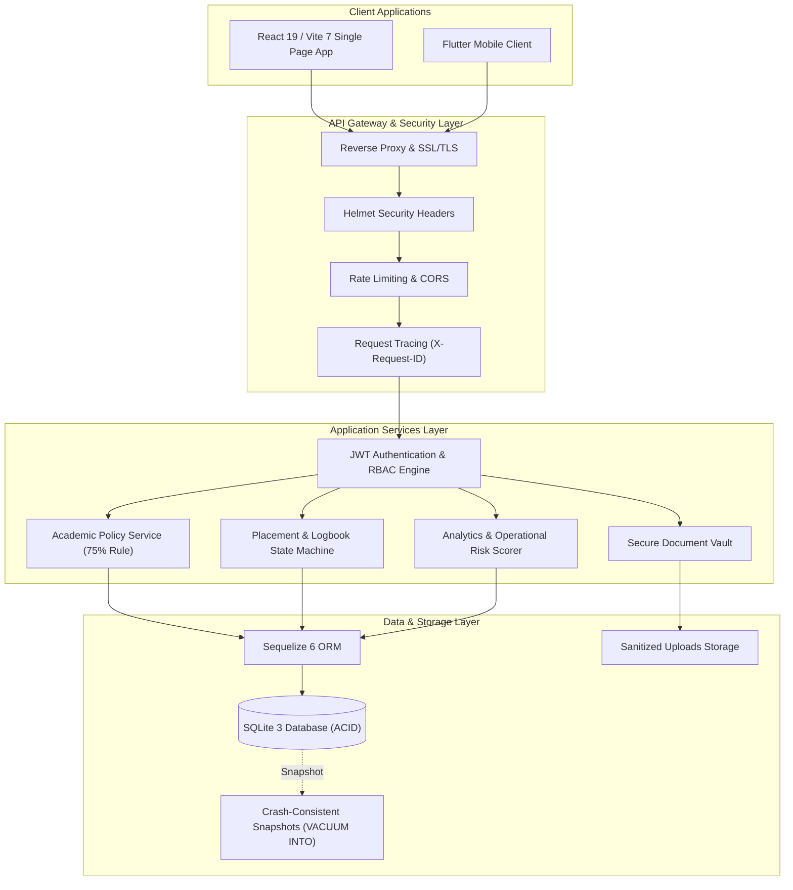

# Attachment Management System (AMS)

The Attachment Management System (AMS) is a full-stack, multi-tenant university platform designed to digitize and manage the entire student industrial attachment (internship) lifecycle. It connects students, host company industry supervisors, university visiting supervisors, attachment coordinators, and institutional administrators into a unified digital workspace.

---

## The Problem It Solves

Managing university industrial attachments traditionally relies on fragmented paper records, manual signatures, and uncoordinated communication. Common challenges include:

- **Lost or Falsified Logbooks**: Physical paper logbooks are easily damaged, misplaced, or filled out retroactively with no verification trail.
- **Unverified Attendance**: Institutions struggle to track daily student presence at remote workplaces, leading to attendance disputes.
- **Disconnected Supervision**: University visiting supervisors, workplace supervisors, and academic departments operate in silos with no shared view of student progress.
- **Manual Administrative Burden**: Coordinators and school admins spend hundreds of hours manually matching supervisors to students, reviewing physical forms, and computing completion eligibility.
- **Lack of Early Warning Systems**: Students struggling with attendance, delayed logbook submissions, or missing supervisor visits often go unnoticed until final grading deadlines have passed.

---

## How AMS Solves It

AMS replaces manual paper workflows with a centralized, role-based digital platform:

- **Digital Logbook & Revision Workflow**: Students submit structured weekly logs online. Industry supervisors review, approve, or request revisions with specific feedback, maintaining a tamper-evident audit history.
- **Verified Daily Attendance**: Tamper-resistant attendance tracking gives supervisors and academic coordinators immediate visibility into student presence.
- **Unified Academic Policy Engine**: Authoritative, centralized compliance rules automatically calculate attendance percentages (75% threshold) and identify completion blockers before graduation deadlines.
- **Coordinator & Supervisor Allocation**: Attachment coordinators can manage host companies, allocate university and industry supervisors, monitor supervisor workloads, and track reassignment history.
- **Operational Risk Scoring & Diagnostics**: Deterministic intelligence identifies students at risk of non-completion due to low attendance, unreviewed logbooks, or missing academic assessments.
- **Secure Evidence & Document Vault**: Centralized storage for official acceptance letters, insurance forms, and evaluation reports with MIME validation and directory traversal protection.
- **Multi-Tenant Institutional Isolation**: Supports multiple independent schools and faculties on a single platform with dedicated branding, custom primary colors, and isolated data boundaries.

---

## System Architecture & Tech Stack



### Core Technologies
- **Frontend**: React 19, Vite 7, Tailwind CSS 4, React Router, Lucide Icons, Axios.
- **Backend**: Node.js (v20+ LTS), Express 4, Sequelize 6 ORM, SQLite 3, JWT Authentication, bcryptjs.
- **Security & Utilities**: Helmet, custom rate limiting, Multer file sanitization, PDFKit report generator.

---

## Supported Roles & Workspaces

The platform provides 6 distinct role-tailored portals:

| Role | Workspace Description |
|---|---|
| **Student** | Apply for placements, log daily attendance, submit weekly logbooks, respond to supervisor revisions, and track academic milestones. |
| **Industry Supervisor** | Verify daily attendance, review and approve logbooks with feedback, and complete industry evaluation forms. |
| **University Supervisor** | Access assigned student rosters, record on-site/virtual supervision visits, and submit academic assessments. |
| **Attachment Coordinator** | Oversee institutional attachment funnels, manage the host organization directory, allocate supervisors, and resolve completion blockers. |
| **School Admin** | Manage student and supervisor accounts, customize institutional branding, export CSV reports, and audit data quality. |
| **Super Admin** | Manage system-wide institutions, onboard schools, monitor server health, and inspect global audit logs. |

---

## Automated Testing & Verification

AMS includes an automated end-to-end integration test suite (`server/test_verification.js`) containing **115 passing tests** across 29 architectural areas:

- **Authentication & Security**: JWT signing/expiry, bcrypt password hashing, account lockout after 5 failed attempts, privilege escalation prevention, and input sanitization.
- **Role-Based Access Control (RBAC)**: Enforced authorization across all 6 roles with multi-tenant data boundary isolation.
- **Workflow State Machines**: Complete placement approval lifecycles, logbook submission-revision-resubmission loops, and locked approved records.
- **Academic Compliance**: Centralized attendance policy enforcement (75% minimum, <60% critical deficiency) and readiness diagnostics.
- **Data Protection & Observability**: Directory traversal defenses, `/health` and `/ready` probes, request correlation tracking (`X-Request-ID`), and transactional snapshot backups (`VACUUM INTO`).

---

## Quick Start (Run Locally)

### Prerequisites
- **Node.js**: v20.x or higher (`node -v`)
- **npm**: v9+ (`npm -v`)

### 1. Start the Backend API Server
```bash
cd server
npm install
npm run dev
```
*The backend API server will start on `http://localhost:5000`.*

### 2. Start the Frontend Client
```bash
# In a separate terminal window:
cd client
npm install
npm run dev
```
*The web interface will launch on `http://localhost:5173`.*

### 3. Run the Automated Tests
```bash
cd server
npm test
```

---

## Default Test Accounts

After starting the server, you can sign in with any of the following pre-configured accounts (Password: `password123`):

| Role | Email | Password |
|---|---|---|
| **Super Admin** | `superadmin@ams.com` | `password123` |
| **School Admin** | `schooladmin_a@ams.com` | `password123` |
| **Attachment Coordinator** | `coordinator_a@ams.com` | `password123` |
| **University Supervisor** | `unisup_a@ams.com` | `password123` |
| **Industry Supervisor** | `supervisor_a@ams.com` | `password123` |
| **Student** | `student_a@ams.com` | `password123` |
